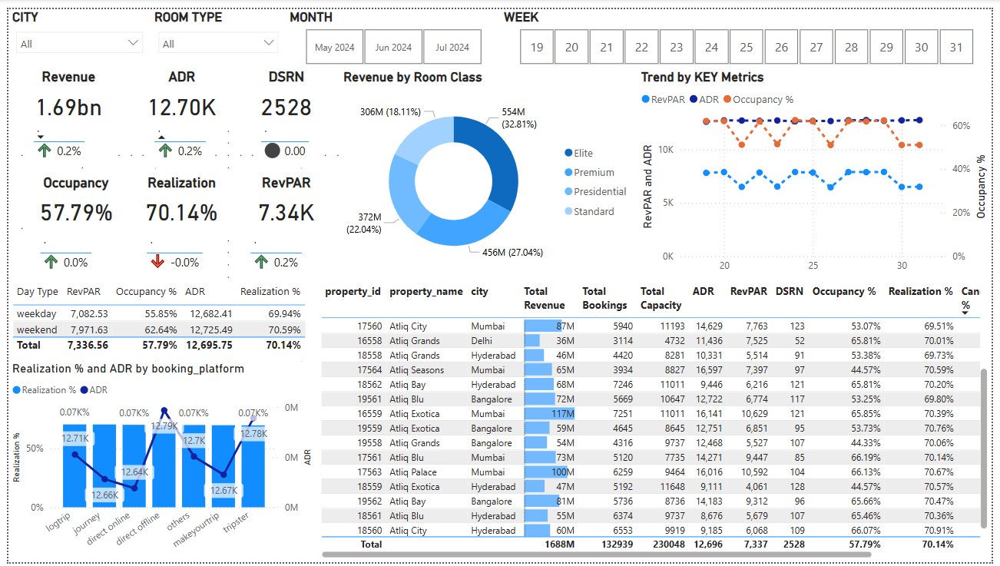
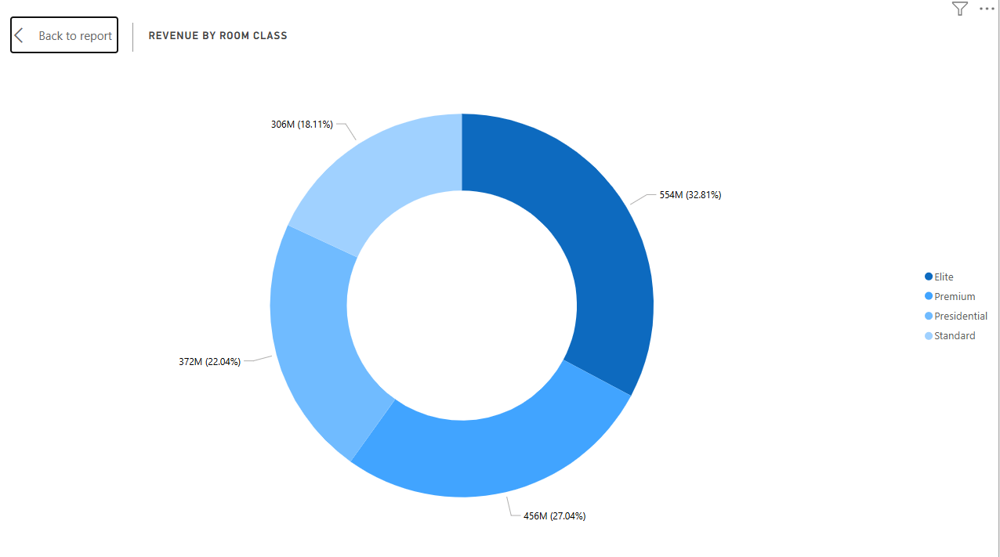
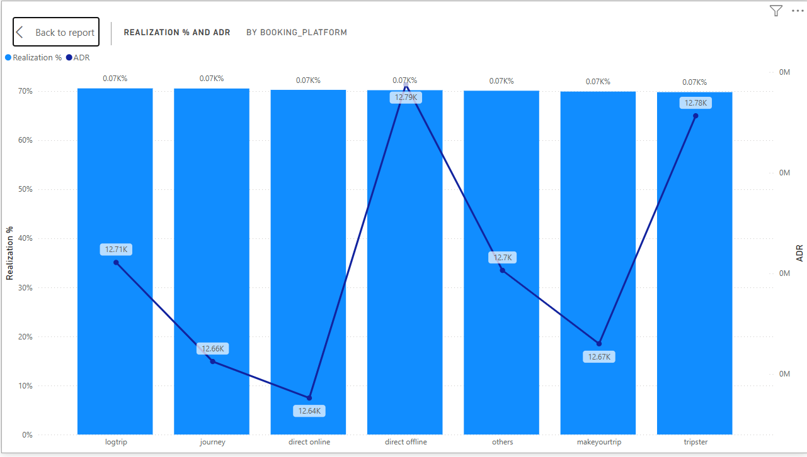
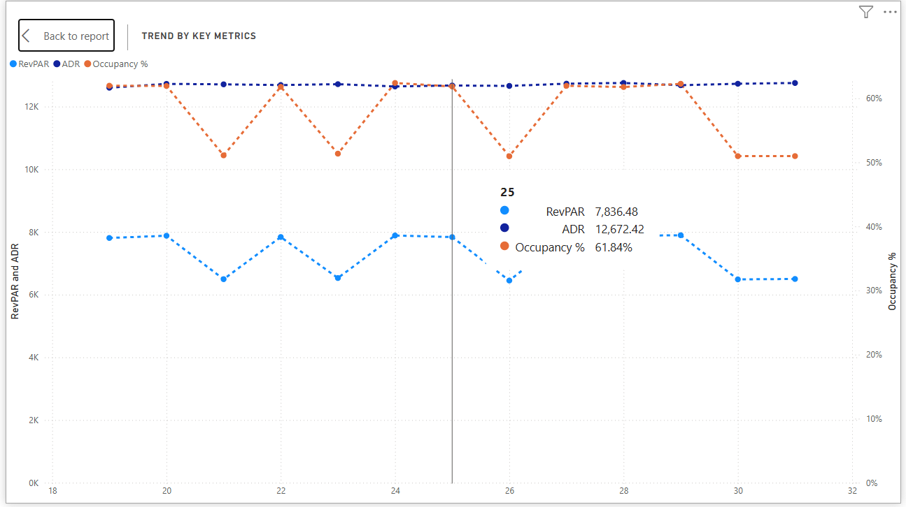

# Hotel Revenue & Booking Optimization Dashboard

## Overview
This Power BI dashboard replicates the revenue and booking analysis approach used in my previous work for **Premier Inn**, applying the same data-driven methodology to luxury hotel data. It focuses on optimizing key performance metrics such as **Revenue**, **ADR (Average Daily Rate)**, **DSRN (Daily Sellable Room Nights)**, **Occupancy**, **Realization**, and **RevPAR (Revenue Per Available Room)**.

By leveraging interactive visualizations, DAX calculations, and data modeling, this project demonstrates how real-time insights can enhance pricing strategies, boost occupancy rates, and improve overall revenue management—similar to the optimizations implemented at Premier Inn.

The dataset includes information from five CSV files, covering dimensions like dates, hotels, rooms, and facts about bookings and aggregated bookings. The dashboard visualizes trends, patterns, and insights derived from this data.

---

## Dataset Description
The dataset consists of five CSV files:

### 1. **dim_date**
   - `date`: Dates in May, June, and July.
   - `mmm yy`: Date in the format of month name and year (e.g., "May 23").
   - `week no`: Unique week number for the date.
   - `day_type`: Indicates whether the day is a "Weekend" or "Weekday".

### 2. **dim_hotels**
   - `property_id`: Unique ID for each hotel.
   - `property_name`: Name of the hotel.
   - `category`: Class of the hotel (e.g., Luxury, Business).
   - `city`: City where the hotel is located.

### 3. **dim_rooms**
   - `room_id`: Type of room (e.g., RT1, RT2, RT3, RT4).
   - `room_class`: Class of the room (e.g., Standard, Elite, Premium, Presidential).

### 4. **fact_aggregated_bookings**
   - `property_id`: Unique ID for each hotel.
   - `check_in_date`: Date of customer check-in.
   - `room_category`: Type of room booked.
   - `successful_bookings`: Number of successful bookings for a room type on a specific date.
   - `capacity`: Maximum number of rooms available for a room type on a specific date.

### 5. **fact_bookings**
   - `booking_id`: Unique ID for each booking.
   - `property_id`: Unique ID for each hotel.
   - `booking_date`: Date the booking was made.
   - `check_in_date`: Date of customer check-in.
   - `check_out_date`: Date of customer check-out.
   - `no_guests`: Number of guests in the booking.
   - `room_category`: Type of room booked.
   - `booking_platform`: Platform used for booking (e.g., website, app, etc.).
   - `ratings_given`: Ratings provided by the customer.
   - `booking_status`: Status of the booking (e.g., "Cancelled", "Checked Out", "No Show").
   - `revenue_generated`: Total revenue generated from the booking.
   - `revenue_realized`: Final revenue realized by the hotel after deductions (e.g., 40% deducted for cancellations).

---

## Key Features of the Dashboard
### **Key Metrics (KPI Cards)**
The dashboard provides KPI cards for the following metrics:
- **Revenue**
- **ADR (Average Daily Rate)**
- **DSRN (Daily Sellable Room Nights)**
- **Occupancy**
- **Realization**
- **RevPAR (Revenue Per Available Room)**

Each KPI card includes a **tooltip** that shows the trend of the metric over weeks.

### **Slicers**
Interactive slicers are provided for:
- **City**
- **Room Type**
- **Month**
- **Week Number**

### **Visualizations**
1. **Pie Chart**: Revenue distribution by room class.
2. **Line and Stacked Column Chart**: 
   - Realization percentage.
   - ADR (Average Daily Rate) by booking platform.
3. **Table**: 
   - Displays detailed information for each property, including:
     - Property ID
     - Property Name
     - City
     - Total Revenue
     - Total Bookings
     - Total Capacity
     - ADR
     - RevPAR
     - DSRN
     - Occupancy %
     - Realization %
     - Cancellation Rate
     - Average Rating

---

## Insights Provided
1. **Revenue Analysis**: Track revenue generated and realized, and compare performance across hotels.
2. **Occupancy Trends**: Monitor room occupancy rates and capacity utilization.
3. **Booking Platform Performance**: Analyze ADR and realization percentages by booking platform.
4. **Room Class Performance**: Understand revenue contribution by room class.
5. **Cancellation Impact**: Evaluate cancellation rates and their effect on revenue.

---

## How to Use
1. Download the `.pbix` file and open it in Power BI Desktop.
2. Use the **slicers** (City, Room Type, Month, Week Number) to filter the data and explore specific segments.
3. Hover over the **KPI cards** to view trends over weeks.
4. Interact with the **visualizations** (pie chart, line and stacked column chart, table) to gain deeper insights.

---

## Screenshots
  
*Description: Main dashboard page showing KPI cards, slicers, and visualizations.*

  
*Description: Pie chart showing revenue distribution by room class.*

  
*Description: Line and stacked column chart showing realization percentage and ADR by booking platform.*

  
*Description: Line chart showing trend of [RevPAR and ADR by weeks.*

---

## Tools Used
- **Power BI**: For data visualization and dashboard creation.
- **Excel**: For initial data cleaning and preprocessing.

---

## License
This project is licensed under the MIT License. See the [LICENSE](LICENSE) file for details.

---

## Contact
For questions or feedback, feel free to reach out to **Hrithick Barani** at hrithickbarani555@gmail.com.
